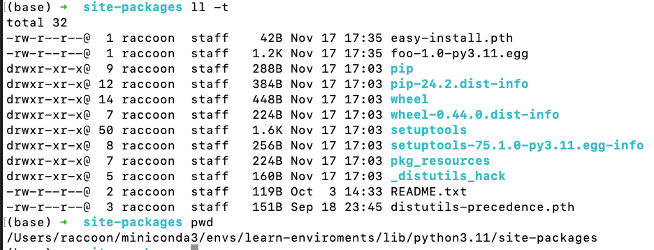
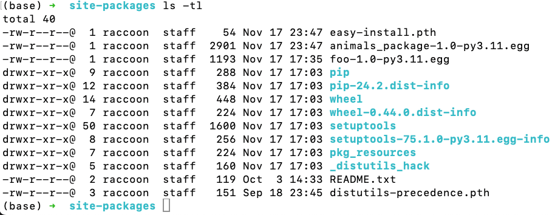
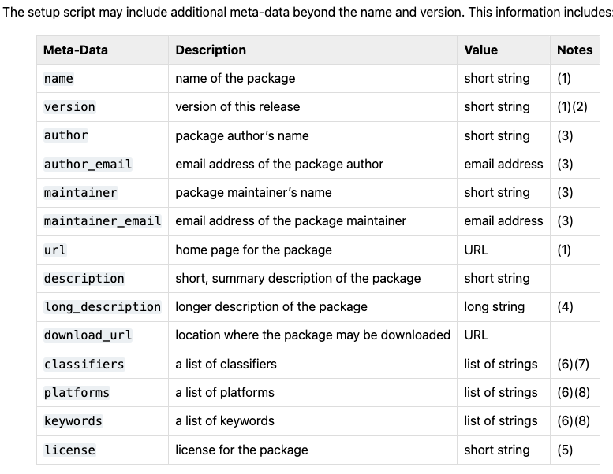
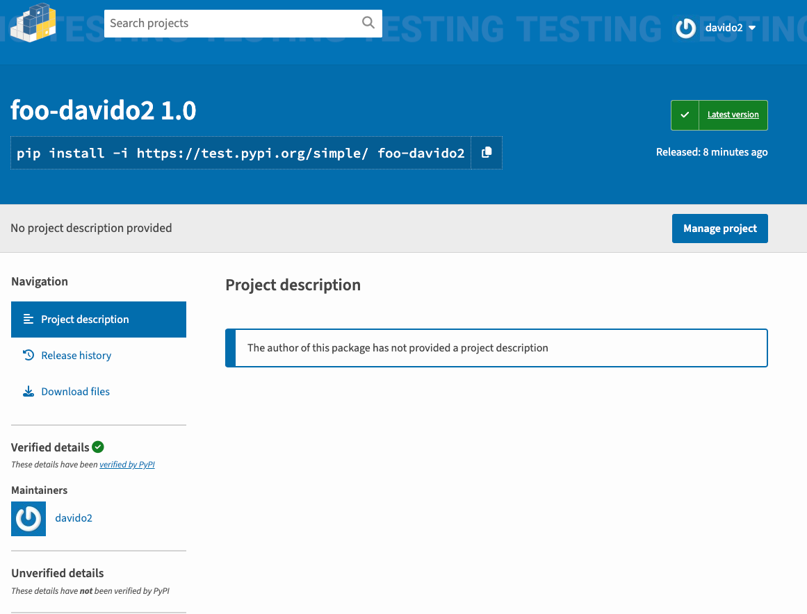

There are 3 types config to setup a project (simple way, of course, there are many other ways)
1. use `setup.py`
2. use requirements.txt
3. use environment.yml

### 1. use `setup.py`

- package your project as a python package that can be installed via pip (package your source code, documentation, and other resources into a distributable package)
- manage complex dependencies or project-specific dependencies

Tutorial: [tutorial](https://docs.python.org/3.11/distutils/setupscript.html)

#### 1. a simple example: distribute a single module called foo, contained in a file named `foo.py`  

```python
from distutils.core import setup
setup(name='foo',
      version='1.0',
      py_modules=['foo'],
      )
```

some observations:
- you supply to the Distutils is supplied as keyword arguments to the setup() function
- those keyword fall into two categories: 
  - package metadata: name, version, description, etc.
  - information about what's in the package: modules (in this case), packages, scripts, etc.
- modules are specified by module name, not filename (the same will hold true for packages and extensions)
- you should supply a little more metadata, in particular your name, email address, and a url for the project (see in 2)

create a source distribution:  
```shell
python setup.py sdist
```
- sdist create an archive file (tarball on Unix, zip file on Windows)
- your module `foo.py`, the archive file will be renamed `foo-1.0.tar.gz` or `foo-1.0.zip` and unpack directory `foo-1.0`
- if an end-user wishes to install your `foo` module, all they have to do download `foo-1.0.tar.gz`, unpack `tar -xzvf foo-10.0.tar.gz` and run `python setup.py install` (cd into folder that was unzipped), which will ultimately copy `foo.py` to the appropriate directory for third-party modules in their Python installation

result:

- file *.egg is a distribution format of Python packages

use
```python
from foo import foo

if __name__ == '__main__':
    print(foo()) # Hi, I am foo!
```

note
- both developers and installers have the same basic user interface `setup script`, the different is which Distutils command they use
  - sdist: developers
  - install: installers
- other useful built distribution formats are (not focus in this tutorial) 
  - RPM, implemented by `bdist_rpm`
  - Solaris pkgtool, implemented by `bdist_pkg`
  - HP-UX: `bdist_hpux`

some basic knowledge:
- module: the basic unit of code re-usability in Python: three types of modules
  - pure Python module: a file containing Python code
  - extension module: a file containing C code that extends Python
  - built-in module: a module that is linked into the Python interpreter
- pure Python module: 
  - a file containing Python code and contained in a single file .py
- extension module:
  - a module written in the low-level language of the Python implementation: C/C++ for Python, Java for Jython. 
  - Typically contained in a single dynamically loadable pre-compiled file (i.e .so) file for Python extensions on Unix, a DLL (.pyd extension) for python extensions on Windows, a Java class file for Jpython extensions (Distutils only handles C/C++ extensions for Python)
- package: a module contains other modules
  - typically contained in a directory in the filesystem and distinguished from other directories by the presence of a file `__init__.py` (this file can be empty)

some Distutils-specific terminology 
- module distribution
  - a collection of Python modules distributed together as a single downloadable resource
  - example: Numpy, Scipy, Matplotlib
  - this would be called a package in the context of Python's module system
  - a single module distribution can contain 0, 1 or many Python packages
- pure module distribution
  - a module distribution that contains only pure Python modules and packages (pure distribution)
- distribution root
  - top-level directory of your source tree (or source distribution); the directory where `setup.py` exists. Generally `setup.py` will be run from this directory


#### 2. write the setup script

- setup script is the center of all activities in building, distributing, and installing modules using the Distutils
- note that any path names (file or directories) supplied in the setup script should be written using the Unix convention with `/` symbol 
- `__init__.py` file to make a directory a package and define how end-users can interact with the package (base on package's value in setup script)


##### 2.1 listing whole package

- packages option tells the Distutils to precess (build, distribute, install, etc.) all pure Python modules found in each package mentioned in the package list.
- have to be a correspondence between package names and directories in the filesystem
- the default correspondence is the most obvious one (i.e. package `distutils` is found in the directory `distutils` relative to the distribution root)
- thus, `packages = ['food']` in your script, you are promising that the Distutils will find a file `foo/__init__.py`
- if you break this promise, the Distutils will issue a warning but still process the broken package anyway
- a different convention to lay out your source directory, you have to supply the `package_dir` option to tell the Distutils about your layout
  - `package_dir = {'': 'lib'}` keep all python source under `lib` directory, so that modules in `root package` (i.e. not in any package at all) are `lib`, module in `foo` package in `lib/foo`
- although `package_dir` applies recursively, you must explicitly list all packages in `packages` (Distutils will not recursively scan your source tree looking for any directory with an `__init__.py` file)
  - `package_dir = {'foo': 'lib''}`, `packages = ['foo', 'foo.bar']` tell Distutils to look for `lib/__init__.py` and `lib/bar/__init__.py`
  - `lib` = `foo`

[example](setup_example/2-write-a-setup-script)


some observations:
- open source code at 2-1-listing-whole-package
- mark `src` as the source root directory
- package distribution module `python setup.py sdist`
- test: unzip the distribution file in `dist` folder, run `python setup.py install` in the unzipped folder
- run testcase in `test.py`

##### 2.2 listing individual modules

- for a small distribution, you may prefer to list all the modules than listing packages
- especially, the case of a single module distribution that goes in the `root package` (i.e. no package at all)
- this simplest case was show in [1. a simple example](setup_example/1-introduce-to-Distutils/setup.py)

```python
py_modules = ['mod1', 'pkg.mod2']
```
- this describes two modules, one of them in the `root` package, the other in `pkg` package
- again, default layout: the module `mod1` is found in the file `mod1.py`, the module `pkg.mod2` is found in the file `pkg/mod2.py` and `pkg/__init__.py` must exist

[example](setup_example/2-write-a-setup-script/2-2-list-invidual-modules)

note
- some prerequisites is the same as in 2.1 (setup, run and unittest, etc.)
- modules must be placed in root directory

##### 2.3 describing extension modules

- writing a Python extension module is a bit more complicated than writing a pure Python module, describing them to the `Distutils`
- unlike pure modules, it's not enough to list modules or packages and expect the `Distutils` to find the right files
- you have to specify the extension name, source files, any compile/link requirements (include directories, libraries, etc. link with) 
- all of this is done through `ext_modules` keyword in `setup()` script. it is just a list of `Extension` instances, each extension describes a single extension module

i.e.:
```python
Extension('foo', ['foo.c'])
```
full example:

```python
from distutils.core import setup, Extension
setup(name='foo',
      version='1.0',
      ext_modules=[Extension('hello', ['hello.c'])],
      )
```

note
- I don't want to talk too much about how to write a C extension module or other languages, just focus on how to describe them to the `Distutils`
- i describe a simple example in [2.3-describing-extension-modules](setup_example/2-write-a-setup-script/2-3-describing-extension-modules/hello.c)
- some steps to create `source distribution` and `install` are the same as in 2.1

##### 2.4 relationships between packages and Distributions

- a distribution may relate to packages in three specific ways
  - it require packages or module
  - it can provide packages or modules
  - it can obsolete packages or modules
- to specify that any version of a package or module is required, the string should consist entirely of the package or module name.
- some restrictions on the version number can be specified using the `==`, `>=`, `<=`, `!=`, `<`, and `>` operators
  - == : only that version is compatible
  - `>1.0, !=1.5.1, <2.0` (combine conditions) : any version greater than 1.0, any version except 1.5.1, any version less than 2.0
- a package can declare that it obsoletes other packages using the `obsoletes` keyword argument. The value of this is similar to that of the `requires` keyword
- each specifier consists of a module or package name optionally followed by one or more version qualifiers
- version qualifiers are given in parentheses and separated by commas after the module or package name

- use case
  - use `provides`
    - your package implements a standard interface, and you want to make sure that users have a compatible version of your package
    - your package is a drop-in replacement for another package
    - your package supply a function that is similar to a function in another package
  - don't use `provides`
    - it's a normal package
    - it doesn't drop-in replacement for another package
    - it doesn't implement a standard interface

example:
1. your package implement a standard interface

```python
from distutils.core import setup

setup(
    name='my_database',
    packages=['my_database'],
    provides=['sql_interface'],  # package này cung cấp interface giống như package sql_interface
)
```

2. your package is a drop-in replacement for another package

```python
from distutils.core import setup

setup(
    name='pillow',
    packages=['PIL'],
    provides=['PIL'],  # Pillow có thể thay thế cho Python Imaging Library (PIL)
)
```

3. your package define some restricted dependencies (`requires`)

```python
# Các cách khai báo requires khác nhau:
requires=[
    # Version cụ thể
    'package==1.0.0',
    
    # Version tối thiểu
    'package>=1.0.0',
    
    # Range version
    'package>=1.0.0,<=2.0.0',
    
    # Không quan tâm version
    'package',
    
    # Version với các điều kiện phức tạp
    'package (>=1.0.0, !=1.5.0, <2.0.0)',
]
```

4. your package obsolete another package

```python
from distutils.core import setup

setup(
    name='pdf_processor',
    version='3.0.0',
    packages=['pdf_processor'],
    
    obsoletes=[
        # 1. Thay thế các version cũ của chính package này
        'pdf_processor (<3.0.0)',  # Các version dưới 3.0.0 không còn được hỗ trợ
        
        # 2. Thay thế các package legacy
        'old_pdf_toolkit',         # Package cũ đã được gộp vào
        'pdf_converter_suite',     # Package riêng cho conversion được gộp vào
        
        # 3. Thay thế các package cụ thể với range version
        'pdf_tools (>=1.0, <2.0)', # Thay thế pdf_tools từ v1.0 đến v2.0
        
        # 4. Thay thế các package có chức năng tương tự
        'simple_pdf_tools',        # Package basic có chức năng được bao gồm
        'pdf_manipulation_kit'     # Package khác có chức năng tương tự
    ],
    
    # Thông tin bổ sung
    description='Complete PDF processing solution',
    long_description='''
    This package replaces and combines functionality from:
    - Old pdf_processor versions (<3.0.0)
    - old_pdf_toolkit (all versions)
    - pdf_converter_suite (all versions)
    - pdf_tools (versions 1.0-2.0)
    - simple_pdf_tools
    - pdf_manipulation_kit
    
    If you are using any of the above packages, please upgrade to this package.
    '''
)
```

##### 2.5 installing script

- so far we have been dealing with pure and non-pure Python modules, but what about scripts?
- they are usually not run by themselves but imported by scripts
- `Script` are files containing Python source code, intented to be started from the command line
- `Script` don't require Distutils to do anything very complicated
- first line of the script should be `#!` followed by the path to the Python interpreter that should be used to run the script
- by default, it is replaced with the current interpreter location. `--executable` or `-e` option will allow the interpreter path to be explicitly overridden

[example](./setup_example/2-write-a-setup-script/2-5-installing-script)

note
- `/usr/bin/env python` find python interpreter in the system path, `/usr/bin/python3` specify the particular python interpreter
- some steps to create `source distribution` and `install` are the same as in 2.1
- change permission of the script file to make it executable `chmod u+x script.py`
- run: when specifying shebang line: `./myscript`, if ignore shebang line: `python myscript.py `

##### 2.6 installing package data

- often, additional files need to be installed along with your package
- these files are often data that's close related to the package's implementation, or text files containing documentation that might be of interest to programmers using the package
- these files are called `package data`
- using `package_data` keyword in setup script to specify these files
- value must be a mapping from package name to a list of relative path names that should be copied into the package
- the paths are interpreted as relative to the directory containing the package's `__init__.py` file (information from the pack_dir mapping is used if appropriate)

[example](./setup_example/2-write-a-setup-script/2-6-installing-package-data)

note
- `pkg_resources` used to read pkg data, but it's deprecated now

##### 2.7 installing additional files

- `data_files` options can be used to specify additional files needed by the module distribution: configuration files, message catalog, data files, anything which doesn't fit in the previous categories
- `data_files` specifics a sequence of (directory, files) pairs in the following way:

```python
from distutils.core import setup

setup(...,
      data_files=[('bitmaps', ['bm/b1.gif', 'bm/b2.gif']),
                  ('config', ['cfg/data.cfg'])],
     )
```

[example](./setup_example/2-write-a-setup-script/2-7-installing-additional-files)

note
- folder use to store additional files must be created before
- can use post install to do that
```python

def post_install():
    user_home = os.path.expanduser('~')

    # Định nghĩa các thư mục và files
    config_dir = os.path.join(user_home, '.config', 'mypkg')
    default_dir = os.path.join(user_home, '.local', 'share', 'mypkg')
    share_dir = os.path.join(user_home, '.local', 'share', 'docs', 'mypkg')

    # Tạo thư mục
    os.makedirs(config_dir, exist_ok=True)
    os.makedirs(share_dir, exist_ok=True)
```

##### 2.8 additional meta-data



notes:

1. these fields are required.
2. it is recommended that versions take the form major.minor[.patch[.sub]].
3. either the author or the maintainer must be identified. If maintainer is provided, distutils lists it as the author in PKG-INFO.
4. the long_description field is used by PyPI when you publish a package, to build its project page.
5. the license field is a text indicating the license covering the package where the license is not a selection from the “License” Trove classifiers. See the Classifier field. Notice that there’s a licence distribution option which is deprecated but still acts as an alias for license.
6. this field must be a list.
7. The valid classifiers are listed on PyPI.
8. to preserve backward compatibility, this field also accepts a string. If you pass a comma-separated string 'foo, bar', it will be converted to ['foo', 'bar'], Otherwise, it will be converted to a list of one string.

‘short string’
A single line of text, not more than 200 characters.

‘long string’
Multiple lines of plain text in reStructuredText format (see https://docutils.sourceforge.io/).

‘list of strings’
See below.

##### 2.9 Debugging the setup script

- sometimes things go wrong, and the setup script doesn't do what you expect
- `DISTUTILS_DEBUG` environment variable to get some debugging output from the Distutils, `Distutils` will print out a lot of information about what it's doing, dump the full traceback when an exception occurs, and print the whole command line when an external program fails.

#### 3 push source distribution to PyPI
1. create an account on PyPI
2. install twine (a library for interacting with PyPI)
3. create source distribution (tar.gz) and build distribution (.wl): `python setup.py sdist bdist_wheel`. Note, you should cteate a unique source distribution by add username to the name of source version like `foo-davido2`
4. create `.pypirc` file in the home directory in following format
```bash
[distutils]
index-servers =
    testpypi

[testpypi]
  repository = https://test.pypi.org/legacy/
  username = <username>
  password = <token>

```
3. upload use twine `twine upload dist/*` or `twine upload --repository testpypi dist/*` for test
4. the result after upload to PyPI (i do with 1-1-introduce-to-Distutils)



### 2. use requirements.txt

- a file that lists all the dependencies for your project
- `pip` can install all the dependencies for a project from a `requirements.txt` file
- `pip freeze` can generate a `requirements.txt` file
- `pip install -r requirements.txt` to install all the dependencies for a project
- `pip freeze > requirements.txt` to save the dependencies to a `requirements.txt` file

note: use requirements.txt when
- you want to install a simple and understandable project
- easy to maintain and update dependencies
- compatible with development tools like `pip`, `virtualenv`, `pipenv`, etc.
- easy to share with others

### 3. use environment.yml
- use `conda` to create an environment.yml file
- export the environment.yml file: `conda env export > environment.yml`
- `conda env create -f environment.yml` to create a conda environment from an environment.yml file
